<div align="center">



# Hi, I'm Chen Shuo KAI 👋

I build AI products, create content, and turn methods proven in real projects into installable Agent Skills.

**An idea → a workflow → a result you can verify.**

[Explore CS Skills](https://github.com/ChenShuo2004/cs-skills) · [Open-source projects](#open-source-projects) · [Find me on X](https://x.com/ChenshuoAI) · [中文](./README.md)

</div>

## Start with CS Skills

[CS Skills](https://github.com/ChenShuo2004/cs-skills) is my collection of AI workflows for product building, engineering, content, video, research, versioning, and GitHub delivery. Each Skill can be installed on its own.

If you are unsure where to start, use [`$cs-run`](https://github.com/ChenShuo2004/cs-skills/tree/main/cs-run):

```text
Describe the goal → $cs-run chooses a workflow → a specialist Skill executes → verify the result
```

You can tell Codex:

```text
Install cs-run and the specialist Skills needed for my task from https://github.com/ChenShuo2004/cs-skills.
$cs-run Help me turn this product idea into a usable prototype. Choose a workflow and start building.
```

[Browse all Skills, installation steps, and examples →](https://github.com/ChenShuo2004/cs-skills#readme)

## Open-source projects

| Project | What it helps you do |
| --- | --- |
| [CS Skills](https://github.com/ChenShuo2004/cs-skills) | Route an idea, source material, or existing project through a reusable AI workflow and verify the outcome. |
| [cs-board](https://github.com/ChenShuo2004/cs-board) | Generate whiteboard animation videos from a reference voice and Chinese script. |
| [Xiaohuang Skill](https://github.com/ChenShuo2004/cs-xiaohuang-skill) | Extend a consistent brand character into illustrations and content visuals. |

Find more experiments in my [GitHub repositories](https://github.com/ChenShuo2004?tab=repositories) and [product library](https://aiyouwendu.com/products).

## Connect

I share AI tools, content workflows, and product experiments on [X @ChenshuoAI](https://x.com/ChenshuoAI). You can also reach me through my [website](https://everlightai.top).

<div align="center">

<sub>Idea → Build → Ship → Learn → Repeat</sub>

</div>
