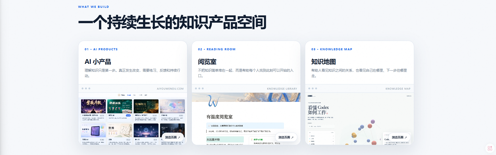
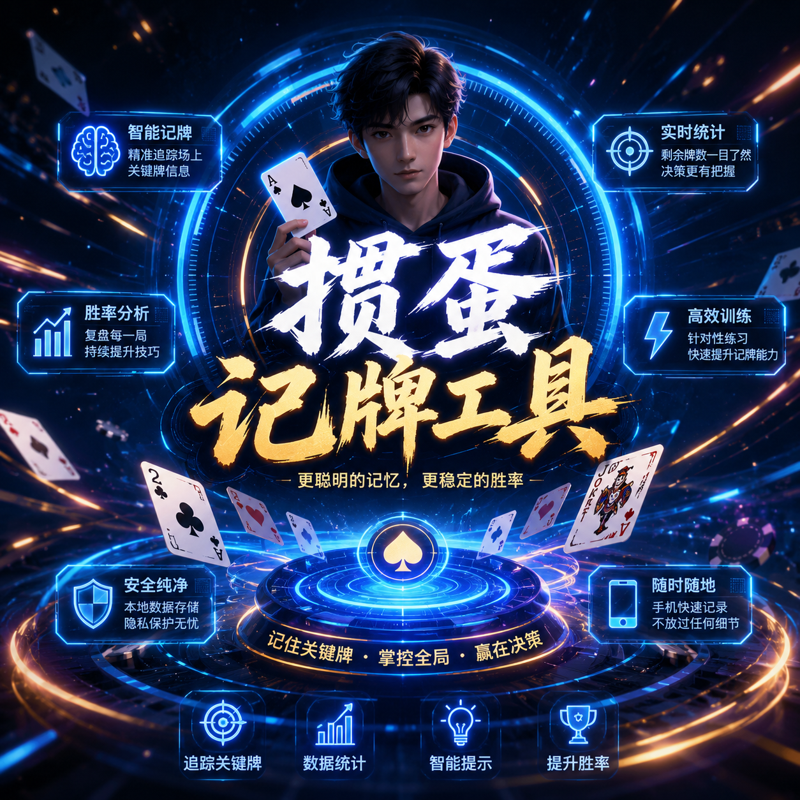
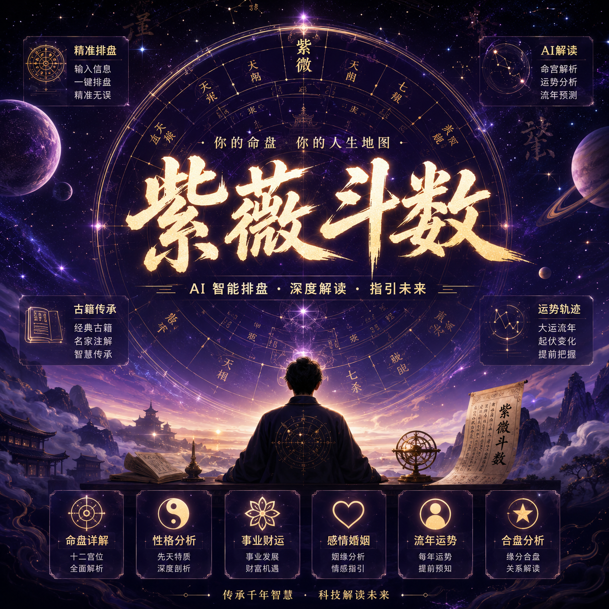
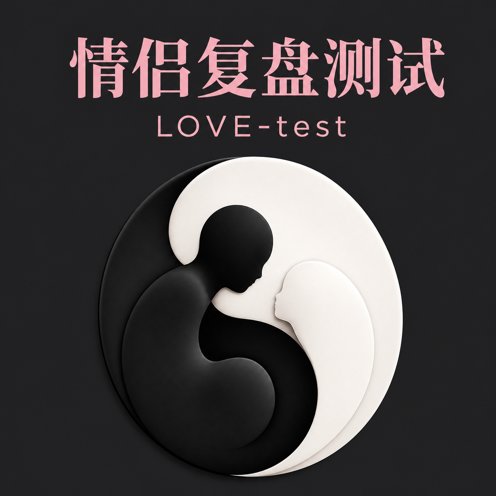
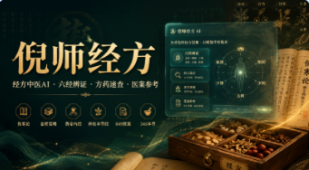

# 有温度团队 · Warmth Team

 

**用 AI 和产品工程，把想法快速做成真正可用的产品。**

[中文](./README.md) · [English](./README.en.md) · [知识库](https://flowus.cn/c712040f-ef98-44b9-b37d-dd187d92fc4d) · [联系我](#联系我)

---

## 我们是谁

我们是有温度团队正在构建面向真实用户的 AI 产品、自动化工具和开源项目。

我们关注的不是把技术堆得更复杂，而是把一个想法更快变成能上线、能验证、能迭代的产品。

## 当前方向

- AI 独立产品与 SaaS
- 自动化工作流与效率工具
- 面向真实使用场景的 MVP
- 开源项目、知识库和产品实验
- AI × 产品 × 商业化的方法沉淀

**快速入口**

[紫微斗数](https://ziwei.aiyouwendu.com/) · [掼蛋训练场](https://guandanmaster.aiyouwendu.com/) · [掼蛋训练器](https://guandan.aiyouwendu.com/products/guandan-trainer) · [情侣复盘测试](https://lovetest.aiyouwendu.com/) · [倪师经方学习助手](https://nishizy.aiyouwendu.com/products/nishizy)

---

## 产品

<table>
  <tr>
    <td width="25%" valign="top" align="center">
      
      <h3>AI 掼蛋记牌</h3>
      
移动端记牌训练工具。

      

        <a href="https://guandanmaster.aiyouwendu.com/">训练场</a> ·
        <a href="https://guandan.aiyouwendu.com/products/guandan-trainer">训练器</a>
      

    </td>
    <td width="25%" valign="top" align="center">
      
      <h3>紫微斗数</h3>
      
排盘、知识库和 AI 解读。

      

        <a href="https://ziwei.aiyouwendu.com/">线上体验</a> ·
        <a href="https://github.com/ChenShuo2004/ziwei">GitHub</a>
      

    </td>
    <td width="25%" valign="top" align="center">
      
      <h3>情侣复盘测试</h3>
      
关系复盘小测试。

      

        <a href="https://lovetest.aiyouwendu.com/">立即体验</a>
      

    </td>
    <td width="25%" valign="top" align="center">
      
      <h3>倪师经方学习助手</h3>
      
经方学习 AI 助手。

      

        <a href="https://nishizy.aiyouwendu.com/products/nishizy">立即体验</a>
      

    </td>
  </tr>
</table>

---

## 技术栈

  

Next.js · React · TypeScript · Tailwind CSS · Python · Node.js · Supabase · Postgres · Vercel · Cloudflare · OpenAI API

---

## 知识库

我会持续把 AI 产品、自动化、开源项目和商业验证中的经验沉淀到知识库：

[有温度团队知识库](https://flowus.cn/c712040f-ef98-44b9-b37d-dd187d92fc4d)

---

## 联系我

- Email: [pqdqqylqxx00321@gmail.com](mailto:pqdqqylqxx00321@gmail.com)
- WeChat: `Chen18005977213`
