# 有温度Lab · Warmth Lab

 

**让人们更容易看见自己、理解问题，并开始一次具体行动。**

[中文](./README.md) · [English](./README.en.md) · [阅览室](https://flowus.cn/c712040f-ef98-44b9-b37d-dd187d92fc4d) · [产品库](https://aiyouwendu.com/products) · [知识地图](https://meditation-knowledge-atlas.vercel.app/) · [下载 App](https://aiyouwendu.com/download) · [反馈与客服](https://aiyouwendu.com/support)

---

## 热门仓库

<table>
  <tr>
    <td width="50%" valign="top">
      <strong><a href="https://github.com/ChenShuo2004/cs-skills">cs-skills</a></strong> 
      陈硕的 Codex Skills 与 AI 工作流手册：把产品、内容、调研与交付沉淀为可复用的智能工作流。 
      AI 工作流 · 开源工具
    </td>
    <td width="50%" valign="top">
      <strong><a href="https://github.com/ChenShuo2004/cs-board">cs-board</a></strong> 
      将参考声音和中文文案自动生成白板动画视频的本地 AI 工具。 
      视频生成 · Python
    </td>
  </tr>
  <tr>
    <td width="50%" valign="top">
      <strong><a href="https://github.com/ChenShuo2004/ziwei">ziwei</a></strong> 
      基于倪海夏《天纪》体系的紫微斗数开源排盘引擎，包含排盘算法、四化系统、格局知识库与古籍阅读。 
      知识库 · TypeScript
    </td>
    <td width="50%" valign="top">
      <strong><a href="https://github.com/ChenShuo2004/01-guandan">01-guandan</a></strong> 
      移动端优先的掼蛋记牌训练工具，通过 AI 牌局、记忆检查与自适应难度训练关键牌观察能力。 
      训练产品 · TypeScript
    </td>
  </tr>
  <tr>
    <td width="50%" valign="top">
      <strong><a href="https://github.com/ChenShuo2004/guandan-handbook">guandan-handbook</a></strong> 
      按学习路径整理的掼蛋知识库：规则、组牌、记牌、牌权、配合、残局与复盘。 
      知识库 · 掼蛋
    </td>
    <td width="50%" valign="top">
      <strong><a href="https://github.com/ChenShuo2004/chenshuo2004">chenshuo2004</a></strong> 
      有温度 Lab 的 GitHub Profile README 与主页展示。 
      主页 · 开源
    </td>
  </tr>
</table>

这些仓库覆盖 AI 工作流、白板视频、紫微斗数与掼蛋训练等公开产品。

---

## 我们在做什么

有温度是一个面向普通人的 TOC 产品实验室。

我们从真实生活里的感受、困惑和小问题出发，把内容、知识结构和互动工具连接起来，做成可以被看见、被理解、被使用的产品。

我们不把产品理解为孤立的功能集合，而是在搭建一条从“看见”到“行动”的路径：

**阅览室 → 知识地图 → 产品库**

## 三个入口，三种帮助

### 01 · 阅览室：先让人停下来，看见自己

很多时候，人们不是没有问题，而是不知道如何开始表达。

阅览室提供轻量、低压力的内容和体验入口，让人先从一个真实感受、一段关系或一个当下时刻开始，慢慢看见自己正在经历什么。

**主入口：** [有温度阅览室与知识库](https://flowus.cn/c712040f-ef98-44b9-b37d-dd187d92fc4d)

**代表产品：** [WARMTH 关系复盘](https://lovetest.aiyouwendu.com/) · [Inner Space 三分钟冥想](https://inner-space.aiyouwendu.com/)

**它带来的帮助：** 把“我说不清楚”变成一个可以继续探索的问题。

### 02 · 知识地图：把问题放回结构里理解

当问题出现之后，人们需要的往往不是一个简单结论，而是知道它和哪些概念、实践、证据及边界有关。

知识地图把零散信息组织成可以浏览的关系网络，让用户从一个真实问题出发，沿着节点和连接逐步深入。

**当前地图：** [冥想知识地图](https://meditation-knowledge-atlas.vercel.app/)

当前公开版本包含 208 个知识页面和 755 条有理由的连接。

**它带来的帮助：** 从“我遇到了什么”走向“我可以怎样理解它、怎样继续判断”。

### 03 · 产品库：把理解变成一次行动

理解只有在生活里产生下一步，才真正有价值。

产品库把知识、训练、表达、关系、专注和自我探索等场景，做成可以直接打开和使用的产品。用户不需要先学习复杂方法，可以从一个小练习或一个具体工具开始。

**浏览产品：** [有温度产品库](https://aiyouwendu.com/products)

**下载入口：** [有温度 App](https://aiyouwendu.com/download)

**它带来的帮助：** 让“我想改变一点”变成今天就能完成的一次具体行动。

## 快速入口

[阅览室与知识库](https://flowus.cn/c712040f-ef98-44b9-b37d-dd187d92fc4d) · [产品库](https://aiyouwendu.com/products) · [知识地图](https://meditation-knowledge-atlas.vercel.app/) · [紫微斗数](https://ziwei.aiyouwendu.com/) · [掼蛋训练场](https://guandanmaster.aiyouwendu.com/) · [掼蛋训练器](https://guandan.aiyouwendu.com/products/guandan-trainer) · [情侣复盘测试](https://lovetest.aiyouwendu.com/) · [倪师经方学习助手](https://nishizy.aiyouwendu.com/products/nishizy)

---

## 产品库

产品库不是产品堆，而是帮助人们从一个具体场景开始行动的入口。

<table>
  <tr>
    <td width="25%" valign="top" align="center">
      
      <h3>AI 掼蛋记牌</h3>
      
移动端记牌训练工具。

      

        <a href="https://guandanmaster.aiyouwendu.com/">训练场</a> ·
        <a href="https://guandan.aiyouwendu.com/products/guandan-trainer">训练器</a>
      

    </td>
    <td width="25%" valign="top" align="center">
      
      <h3>紫微斗数</h3>
      
排盘、知识库和 AI 解读。

      

        <a href="https://ziwei.aiyouwendu.com/">线上体验</a> ·
        <a href="https://github.com/ChenShuo2004/ziwei">GitHub</a>
      

    </td>
    <td width="25%" valign="top" align="center">
      
      <h3>情侣复盘测试</h3>
      
关系复盘小测试。

      

        <a href="https://lovetest.aiyouwendu.com/">立即体验</a>
      

    </td>
    <td width="25%" valign="top" align="center">
      
      <h3>倪师经方学习助手</h3>
      
经方学习 AI 助手。

      

        <a href="https://nishizy.aiyouwendu.com/products/nishizy">立即体验</a>
      

    </td>
  </tr>
</table>

## 我们相信

- 好的 TOC 产品，不是替人给出所有答案，而是让人更容易提出下一个好问题。
- 抽象的感受需要被看见，复杂的知识需要被组织，想要改变的念头需要一个足够小的开始。
- 每个产品都应该让用户在几分钟内获得一次真实反馈，并知道下一步可以做什么。
- 产品可以温柔，但体验必须清楚；内容可以开放，但边界必须诚实。

## 知识库

阅览室的内容和方法会持续沉淀到知识库：

[有温度阅览室与知识库](https://flowus.cn/c712040f-ef98-44b9-b37d-dd187d92fc4d)

## 安全边界

涉及心理、健康、传统文化和自我探索的产品，均用于学习、体验、沟通和自我觉察，不替代医疗诊断、心理治疗或其他专业服务。

请以每个产品 README 中的具体说明、许可证和使用边界为准。

## 反馈与客服

如果你在使用中遇到问题，发现内容错误，或有希望我们做出的新产品：

- [在线客服](https://aiyouwendu.com/support)
- [有温度官网](https://aiyouwendu.com/home)
- [GitHub 项目列表](https://github.com/ChenShuo2004?tab=repositories)

## 技术栈

  

Next.js · React · TypeScript · Tailwind CSS · Python · Node.js · Supabase · Postgres · Vercel · Cloudflare · OpenAI API

