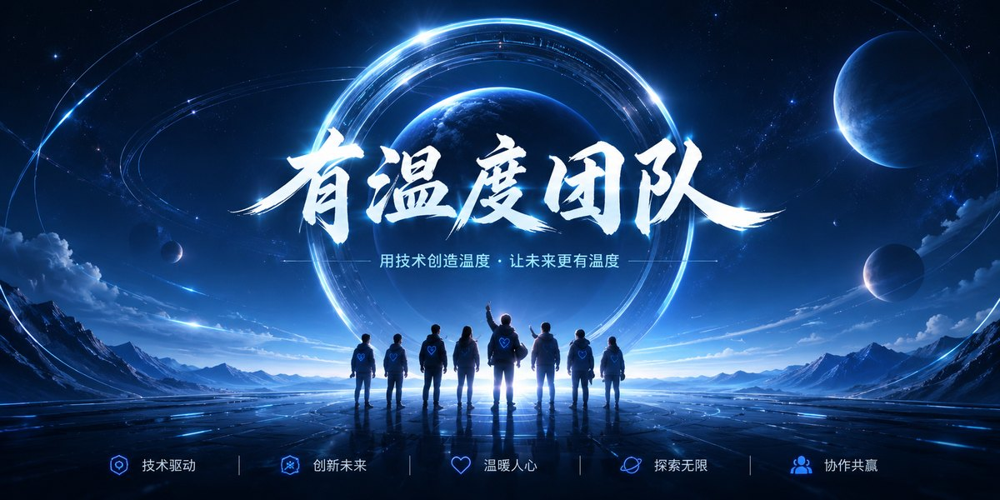

# 有温度团队 · Warmth Team

 

**开源 AI 产品团队 / Open-source AI Product Team**

我们用 AI、自动化和产品工程，把想法更快做成可使用、可验证、可持续迭代的产品。

[中文](#中文) · [English](#english) · [知识库 Knowledge Base](https://flowus.cn/c712040f-ef98-44b9-b37d-dd187d92fc4d) · [联系我们 Contact](#联系我们)

---

## 中文

<table>
  <tr>
    <td width="58%" valign="top">
      <h3>我们是谁</h3>
      
有温度团队是一个专注于 <strong>AI 产品、开源工具和自动化系统</strong> 的产品团队。

      
我们相信：技术不应该只停留在代码里。真正有价值的是把一个想法快速做成产品，让用户能用、团队能验证、业务能增长。

      
<strong>我们正在构建：</strong>

      <ul>
        <li>AI 产品与开源工具</li>
        <li>自动化工作流</li>
        <li>可快速验证的 MVP</li>
        <li>面向真实用户的产品实验</li>
        <li>AI、产品、商业经验知识库</li>
      </ul>
      
<strong>快速入口：</strong>

      

        <a href="https://github.com/ChenShuo2004/01-guandan">AI 掼蛋记牌</a> ·
        <a href="https://github.com/ChenShuo2004/ziwei">紫微斗数</a> ·
        <a href="https://ziwei.aiyouwendu.com/">线上紫微</a> ·
        <a href="https://flowus.cn/c712040f-ef98-44b9-b37d-dd187d92fc4d">团队知识库</a>
      

    </td>
    <td width="42%" valign="top" align="center">
      
    </td>
  </tr>
</table>

### 开源产品

<table>
  <tr>
    <td width="50%" valign="top" align="center">
      
      <h4>AI 掼蛋记牌</h4>
      
移动端优先的掼蛋记牌训练工具，通过自动牌局和即时记忆测试，帮助玩家训练关键牌观察与记忆能力。

      
<a href="https://github.com/ChenShuo2004/01-guandan">查看 GitHub 仓库</a>

    </td>
    <td width="50%" valign="top" align="center">
      
      <h4>紫微斗数 / 紫薇算命</h4>
      
基于紫微斗数体系的排盘、知识库和 AI 解读产品，探索传统知识与 AI 产品体验的结合。

      
<a href="https://github.com/ChenShuo2004/ziwei">查看 GitHub 仓库</a> · <a href="https://ziwei.aiyouwendu.com/">线上体验</a>

    </td>
  </tr>
</table>

### 技术栈

  

Next.js · React · TypeScript · Tailwind CSS · Python · AI API · Vercel · Cloudflare

### 知识库

我们会持续把团队在 AI 产品、自动化、开源项目和商业验证中的经验沉淀到知识库：

[有温度团队知识库](https://flowus.cn/c712040f-ef98-44b9-b37d-dd187d92fc4d)

### 联系我们

- Email: [pqdqqylqxx00321@gmail.com](mailto:pqdqqylqxx00321@gmail.com)
- WeChat: `Chen18005977213`

---

## English

Warmth Team is an open-source AI product team focused on building practical AI products, automation workflows, and MVPs.

We care about turning ideas into real products that people can use, test, and improve.

### Open-source Products

| Product | Description | Links |
| --- | --- | --- |
| AI Guandan Memory Training | A mobile-first card memory training product for Guandan players, using automated games and instant memory tests. | [GitHub](https://github.com/ChenShuo2004/01-guandan) |
| Zi Wei Dou Shu / Metis Ziwei | A Zi Wei Dou Shu charting and AI interpretation product that explores the combination of traditional knowledge and AI product experience. | [GitHub](https://github.com/ChenShuo2004/ziwei) · [Live Site](https://ziwei.aiyouwendu.com/) |

### Knowledge Base

[Warmth Team Knowledge Base](https://flowus.cn/c712040f-ef98-44b9-b37d-dd187d92fc4d)

### Contact

- Email: [pqdqqylqxx00321@gmail.com](mailto:pqdqqylqxx00321@gmail.com)
- WeChat: `Chen18005977213`
