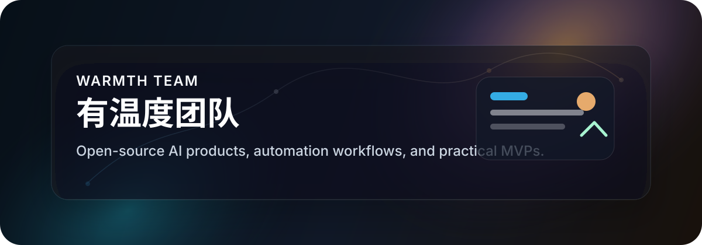
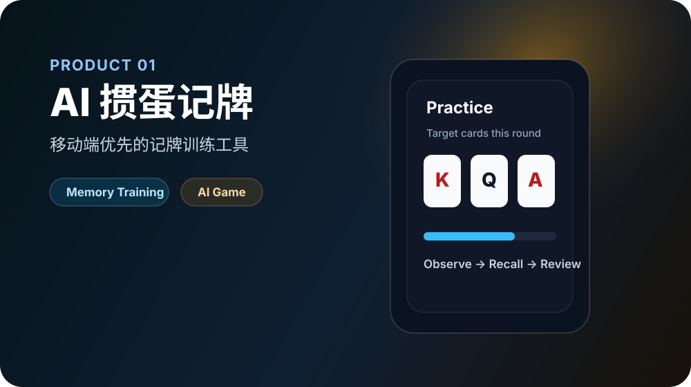
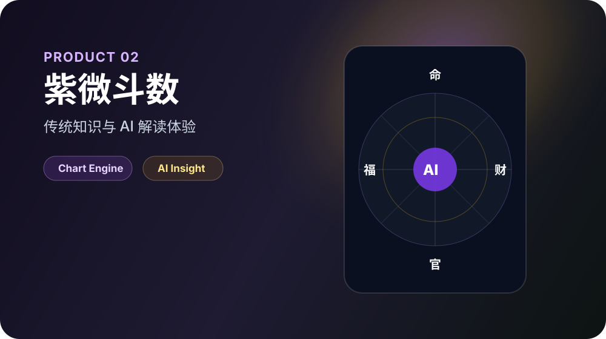

# 有温度团队 · Warmth Team

**开源 AI 产品团队 / Open-source AI Product Team**

我们用 AI、自动化和产品工程，把想法更快做成可使用、可验证、可持续迭代的产品。

We build AI products, automation workflows, and practical MVPs that turn ideas into usable products faster.

[中文](#中文) · [English](#english) · [知识库 Knowledge Base](https://flowus.cn/c712040f-ef98-44b9-b37d-dd187d92fc4d) · [联系我们 Contact](#联系我们)

---

## 中文

### 我们是谁

有温度团队是一个专注于 **AI 产品、开源工具和自动化系统** 的产品团队。

我们相信：技术不应该只停留在代码里，真正有价值的是把一个想法快速做成产品，让用户能用、团队能验证、业务能增长。

### 我们在做什么

- **AI 产品**：围绕真实场景构建可用的 AI 工具
- **开源项目**：把团队正在打磨的产品和能力开放出来
- **自动化工作流**：用 AI 和工程能力减少重复劳动
- **MVP 验证**：快速搭建、快速上线、快速迭代
- **知识沉淀**：把产品、技术、AI 和商业经验整理成知识库

### 开源产品

  
  

| 产品 | 简介 | 入口 |
| --- | --- | --- |
| AI 掼蛋记牌 | 移动端优先的掼蛋记牌训练工具，通过自动牌局和即时记忆测试，帮助玩家训练关键牌观察与记忆能力。 | [GitHub](https://github.com/ChenShuo2004/01-guandan) |
| 紫微斗数 / 紫薇算命 | 基于紫微斗数体系的排盘、知识库和 AI 解读产品，探索传统知识与 AI 产品体验的结合。 | [GitHub](https://github.com/ChenShuo2004/ziwei) · [线上体验](https://metisziwei.com) |

### 技术栈

  

我们常用：Next.js、React、TypeScript、Tailwind CSS、Python、AI API、Vercel、Cloudflare。

### 知识库

我们会持续把团队在 AI 产品、自动化、开源项目和商业验证中的经验沉淀到知识库：

[有温度团队知识库](https://flowus.cn/c712040f-ef98-44b9-b37d-dd187d92fc4d)

### 联系我们

如果你对我们的开源产品、AI 产品实践或团队方向感兴趣，可以通过下面方式联系：

- Email: [pqdqqylqxx00321@gmail.com](mailto:pqdqqylqxx00321@gmail.com)
- WeChat: `Chen18005977213`

---

## English

### Who We Are

Warmth Team is an open-source AI product team focused on building practical AI products, automation workflows, and MVPs.

We care about turning ideas into real products that people can use, test, and improve.

### What We Build

- **AI Products**: Useful tools built around real scenarios
- **Open-source Projects**: Products and experiments shared with the community
- **Automation Workflows**: Systems that reduce repetitive work with AI and engineering
- **MVPs**: Fast product validation through shipping and iteration
- **Knowledge Base**: Notes and frameworks about AI, product building, automation, and business experiments

### Open-source Products

  
  

| Product | Description | Links |
| --- | --- | --- |
| AI Guandan Memory Training | A mobile-first card memory training product for Guandan players, using automated games and instant memory tests. | [GitHub](https://github.com/ChenShuo2004/01-guandan) |
| Zi Wei Dou Shu / Metis Ziwei | A Zi Wei Dou Shu charting and AI interpretation product that explores the combination of traditional knowledge and AI product experience. | [GitHub](https://github.com/ChenShuo2004/ziwei) · [Live Site](https://metisziwei.com) |

### Tech Stack

Next.js, React, TypeScript, Tailwind CSS, Python, AI APIs, Vercel, Cloudflare.

### Knowledge Base

We keep our notes, product thinking, AI experiments, and workflow practices here:

[Warmth Team Knowledge Base](https://flowus.cn/c712040f-ef98-44b9-b37d-dd187d92fc4d)

### Contact

- Email: [pqdqqylqxx00321@gmail.com](mailto:pqdqqylqxx00321@gmail.com)
- WeChat: `Chen18005977213`
